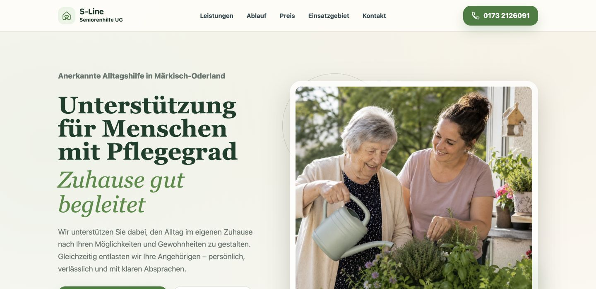
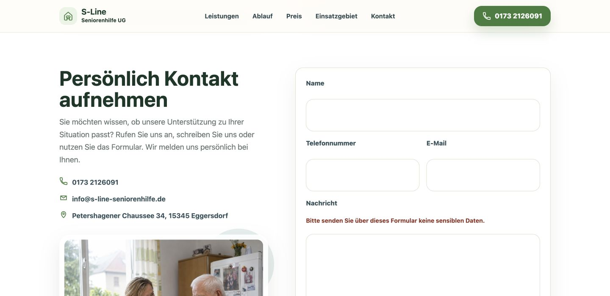
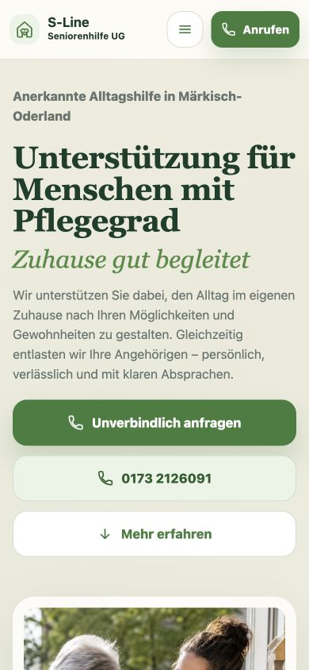
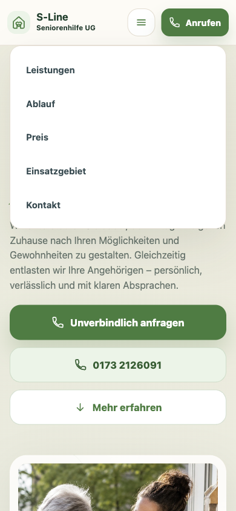
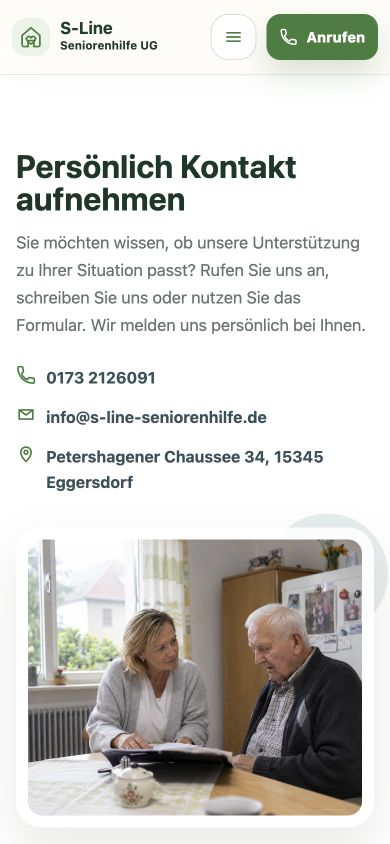
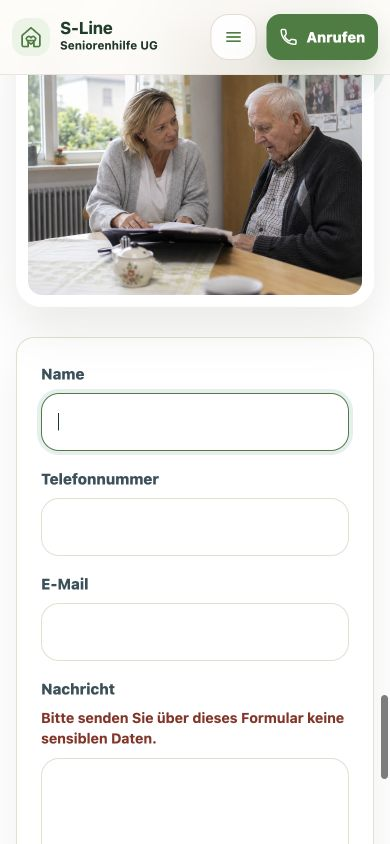
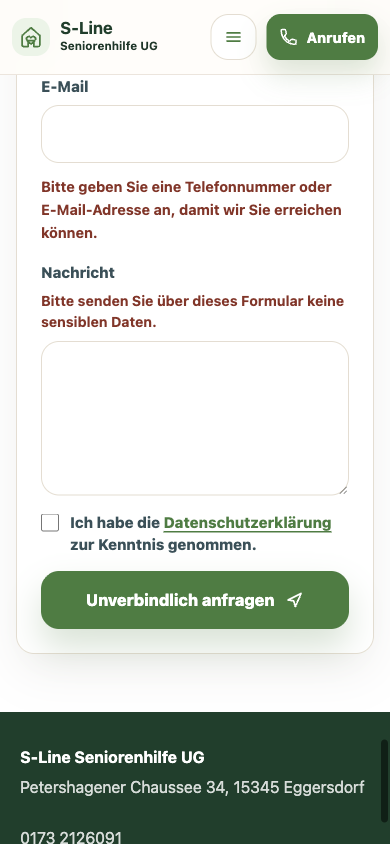
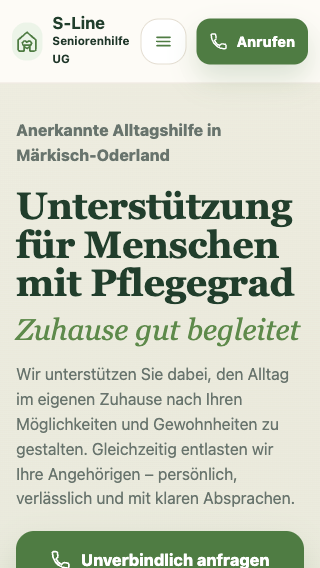
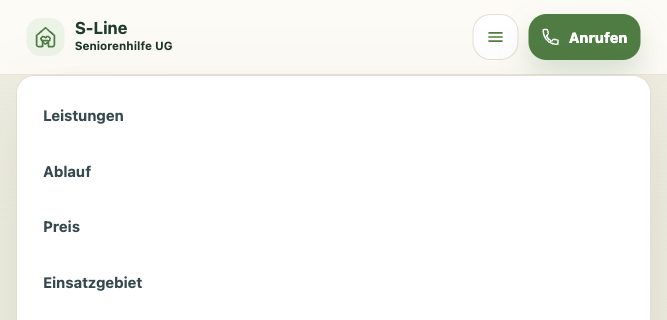
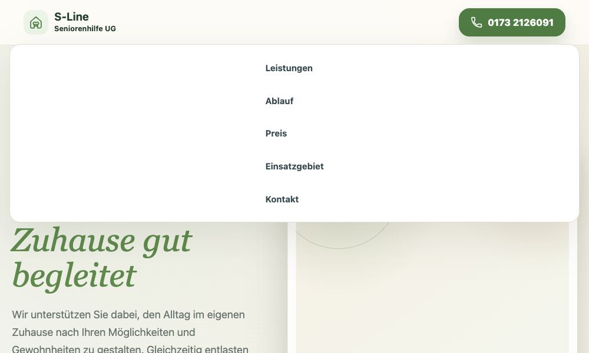

# S-Line Seniorenhilfe — экспертный аудит сайта

Дата проверки: 17 июля 2026 года

Формат: UX, адаптивность, доступность, форма обратной связи, техническая надёжность и базовое SEO.

## Короткий вывод

Сайт уже выглядит профессионально и вызывает доверие: спокойная визуальная подача, понятное описание услуги, заметные способы связи и аккуратная мобильная версия. Сборка и тесты проходят.

В ветке `dev` уже исправлены обе найденные проблемы мобильного меню. Исправление проверено на Cloudflare Preview и пока не переносилось на основной сайт.

Перед активным продвижением остаются два первоочередных пункта:

1. некорректные страницы `404`, которые сейчас выглядят как обычная главная страница;
2. клиентская валидация и аварийный сценарий контактной формы.

Это не требует редизайна. Основу сайта стоит сохранить.

## Версия Git и техническая проверка

- Ветка: `main`.
- Локальная версия совпадает с `origin/main`: расхождение `0 / 0` после `git fetch --prune`.
- Коммит: `11eddfa90fad6101d089eb8ab3df68d9005c7430` — `Fix legal page canonical URLs`.
- Дата коммита: 4 июля 2026 года.
- До добавления этого отчёта рабочее дерево было чистым.
- `npm test`: **41 из 41 тестов пройдены**.
- `npm run build`: **успешно**, собрано 3 статические страницы.

Итог: проверенная локальная версия актуальна относительно GitHub.

## Согласованный процесс исправлений

- Все исправления выполняются только в ветке `dev`.
- Перед первым исправлением `dev` синхронизирована с `main` через fast-forward. Обе ветки указывали на коммит `11eddfa90fad6101d089eb8ab3df68d9005c7430`.
- Рабочая preview-версия ветки: <https://dev.lend-sl.pages.dev>.
- Preview имеет заголовок `X-Robots-Tag: noindex` и не заменяет production-домен.
- В Cloudflare Preview контактная форма принудительно работает в режиме `mock`: тестовые заявки не передаются в Resend. Production сохраняет режим `resend`.
- Для каждого исправления сначала выполняются локальные тесты и production-сборка, затем проверка на preview-версии `dev`.
- Исправление считается завершённым только после фиксации результата в этом документе: статус, дата, коммит и проведённые проверки.
- Ветка `main` и основной сайт не обновляются без отдельного решения владельца проекта.

### Журнал

| Дата | Событие | Коммит | Проверка | Результат |
|---|---|---|---|---|
| 17.07.2026 | Создана исходная точка: `dev` выровнена с `main` | `11eddfa` | Git divergence, Cloudflare branch preview, HTTP headers | `dev` соответствует `main`; preview доступна и закрыта от индексации |
| 17.07.2026 | Тестовая отправка формы изолирована от реальной почты | `c6d8f3a` | 42/42 теста, production-сборка, Cloudflare deploy exact commit, синтетический POST к preview | Preview использует `CONTACT_MODE=mock`; API вернул `HTTP 200`, Resend не вызывается |
| 17.07.2026 | Исправлены мобильное меню в landscape и сброс состояния на desktop breakpoint | `aed915b` | TDD red/green, 44/44 теста, production-сборка, Cloudflare exact-commit deploy, Playwright на `dev` при `667 × 320` и `1000 × 700`, проверка консоли | Исправлено в `dev`: все ссылки доступны через внутреннюю прокрутку; overlay, блокировка body и ARIA сбрасываются; ошибок и предупреждений нет |

## Что уже сделано хорошо

- Визуальный стиль спокойный, человечный и уместный для аудитории пожилых людей и их родственников.
- На мобильном экране сразу доступны звонок и переход к контакту.
- Тексты конкретные, без избыточных обещаний; хорошо работают региональные и юридические сигналы доверия.
- Использованы семантические заголовки, подписи полей, `aria-live`, управление меню с клавиатуры и достаточные размеры основных кнопок.
- Номер телефона, e-mail и форма дают пользователю несколько способов связаться.
- API не записывает персональные данные в логи и отклоняет неподдерживаемые методы.
- Настроены CSP, HSTS, защита от встраивания и другие базовые security headers.

## Приоритеты и статусы

| ID | Приоритет | Статус | Проблема | Почему это важно | Рекомендация |
|---|---|---|---|---|---|
| `ERR-404` | Высокий | Запланировано | Неизвестные URL и файлы возвращают главную страницу с кодом `200` | Поисковик может индексировать дубли, а пользователь не понимает, что адрес ошибочный | Добавить настоящую страницу `404` с `noindex` и убедиться, что Cloudflare возвращает статус `404` |
| `NAV-LANDSCAPE` | Высокий | Исправлено в `dev` | Мобильное меню обрезалось на низком горизонтальном экране | Последняя ссылка была недоступна, при этом прокрутка страницы блокировалась | В `aed915b` добавлены ограничение высоты и внутренняя прокрутка; проверено на Preview при `667 × 320` |
| `NAV-BREAKPOINT` | Высокий | Исправлено в `dev` | Открытое мобильное меню не закрывалось при переходе на desktop breakpoint | Оставалась полноэкранная подложка, а кнопка закрытия исчезала | В `aed915b` добавлен `matchMedia`-сброс `is-open`, `nav-open` и ARIA; проверено на Preview при переходе к `1000 px` |
| `FORM-VALIDATION` | Высокий | Следующее | Валидация формы неполная и может сохранять старую ошибку | Корректные данные могут оставаться «невалидными», а неверный e-mail выглядит как сбой сервера | Использовать единую проверку `checkValidity()`, очищать custom validity на `input`, показывать ошибки по конкретным полям |
| `FORM-NOJS` | Средний | Следующее | У формы нет безопасного сценария без JavaScript | При сбое скрипта браузер по умолчанию может отправить поля через `GET` и добавить данные в URL | Добавить корректный POST fallback либо блокировать отправку до инициализации скрипта |
| `API-ABUSE` | Средний | Запланировано | Защита API от автоматических запросов ограничена honeypot-полем | Бот может обойти поле и создавать расходы/спам через Resend | Добавить rate limit и, при необходимости, Turnstile; проверить настройки Cloudflare отдельно |
| `A11Y-CONTRAST` | Средний | Запланировано | Контраст рамок полей и фокус-индикатора слабый | Пользователям со сниженным зрением сложнее понять границы поля и текущее положение фокуса | Сделать рамку и `:focus-visible` заметнее; проверить контраст до уровня не ниже `3:1` |
| `UX-CONTACT` | Средний | Запланировано | После мобильного CTA форма находится ещё примерно на экран ниже | Пользователь видит контакты и крупную фотографию, но не сразу видит обещанную форму | На мобильном поставить форму раньше изображения или вести CTA прямо к форме |
| `UX-HERO` | Низкий | Запланировано | На desktop основной CTA частично уходит ниже первого экрана | Снижается заметность главного действия на ноутбуках небольшой высоты | Немного уменьшить вертикальные отступы hero или его минимальную высоту |
| `SEO-POLISH` | Низкий | Запланировано | Не хватает favicon и части social/image metadata | Это не ломает сайт, но ухудшает полировку выдачи и вкладки браузера | Добавить favicon, `og:image:alt`, размеры изображения и явные размеры крупных `` |

## Проверенные экраны

### 1. Главная, desktop — требует небольшой доработки

Сильные стороны: понятное позиционирование, доверительная фотография, хорошие региональные сигналы. Риск: при размере `1440 × 701` главный CTA частично оказывается ниже первого экрана. Рекомендуется слегка уменьшить вертикальный объём hero, не меняя композицию.

### 2. Контактный блок, desktop — здоровое состояние

Телефон, e-mail и форма легко сканируются; подписи полей явные. Реальная отправка персональных данных в ходе аудита не выполнялась, поэтому доставка письма через Resend визуально не подтверждена.

### 3. Главная, mobile — здоровое состояние

Ключевые действия видны сразу, текст читается, горизонтального переполнения нет. Верхние кнопки звонка и меню имеют удобный размер.

### 4. Мобильное меню, portrait — здоровое состояние

Меню понятно открывается, состояние отражается через `aria-expanded`, ссылки читаемы. Проблема возникает не здесь, а при небольшой высоте окна — см. шаг 9.

### 5. Переход по мобильному CTA — требует улучшения

Пользователь попадает в правильный раздел, но сначала видит контактные данные и крупное изображение. Сама форма остаётся ниже. Для повышения конверсии стоит приблизить форму к точке перехода.

### 6. Мобильная форма — в целом хорошо

Поля крупные, подписи видимы, состояние фокуса присутствует. Основная проблема — лишняя прокрутка до формы и недостаточный контраст рамки/фокуса.

### 7. Ошибка валидации — требует исправления логики

Хорошо, что ошибка показана рядом с полями и объявляется через alert/status. Однако проверки реализованы разрозненно: неверный формат e-mail не проверяется до запроса, а custom validity для имени, сообщения и чекбокса не очищается при последующем вводе.

### 8. Узкий экран 320 px — здоровое состояние

Горизонтального переполнения нет, шапка и основные действия сохраняют работоспособность. Это хороший результат для минимальной поддерживаемой ширины.

### 9. Меню в landscape — исходное состояние до исправления

На исходной версии при размере `667 × 320` нижний пункт меню выходил за экран. Скриншот сохраняет состояние до исправления. В `dev` проблема исправлена коммитом `aed915b`: меню прокручивается внутри окна, а ссылка «Kontakt» доступна.

### 10. Изменение breakpoint при открытом меню — исходное состояние до исправления

На исходной версии после увеличения окна до `1000 px` сохранялись `is-open`, `nav-open` и открытое ARIA-состояние. Скриншот сохраняет состояние до исправления. В `dev` коммит `aed915b` сбрасывает меню при входе в desktop breakpoint.

## Техническое обоснование ключевых замечаний

### Мобильное меню

В исходной версии класс `body.nav-open` запрещал прокрутку страницы, а фиксированное меню не имело ограничения по высоте и собственной прокрутки. В `aed915b` для открытого меню добавлены `max-height` и `overflow-y: auto`: [global.css](../../src/styles/global.css#L204). Смена desktop breakpoint теперь обрабатывается через `matchMedia`: [script.js](../../public/script.js#L38).

### Контактная форма

Форма содержит `novalidate` и не задаёт `method`/`action`: [ContactCTA.astro](../../src/components/ContactCTA.astro#L29). В [script.js](../../public/script.js#L84) вручную проверяется наличие контакта, имени, сообщения и согласия, но не формат e-mail. Custom validity очищается только у телефона и e-mail, поэтому ошибка имени, сообщения или checkbox может сохраниться после исправления значения.

API выполняет повторную серверную проверку, что правильно: [contact.ts](../../functions/api/contact.ts#L114). При этом стоит дополнительно:

- проверить, что JSON является объектом — сейчас тело `null` может привести к `500`;
- ограничивать фактически прочитанный размер тела, а не доверять только `Content-Length`;
- добавить timeout для запроса к Resend;
- добавить rate limit/Turnstile поверх honeypot, если этого ещё нет в Cloudflare dashboard.

### Доступность

Семантическая база хорошая, но визуальный контраст интерактивных состояний можно усилить. Текущий полупрозрачный focus outline в [global.css](../../src/styles/global.css#L52) даёт примерно `2:1` на светлом фоне; ориентир для заметного фокуса и границ компонентов — `3:1`. Также полезна ссылка «Перейти к содержимому» в самом начале страницы.

### SEO и производительность

Canonical URL, sitemap, robots и Open Graph уже присутствуют. Для завершения стоит добавить настоящую `404`, favicon, размеры/alt для social image, размеры крупных контентных изображений и длительный immutable-cache для хешированных файлов `/_astro/*`.

## Рекомендуемый порядок исправлений

1. **Выполнено в `dev` (`aed915b`):** исправить мобильное меню и добавить регрессионные тесты для `667 × 320` и смены breakpoint.
2. Пересобрать клиентскую валидацию формы и добавить тесты на неверный e-mail и очистку custom validity.
3. Добавить настоящую `404` и проверить HTTP-статусы неизвестных URL/asset-файлов.
4. Усилить API: object schema, фактический лимит body, timeout, rate limit/Turnstile.
5. Поднять контраст полей/фокуса и добавить skip-link.
6. Затем сделать конверсионную и SEO/performance-полировку.

## Границы проверки

- Это не сертификат полного соответствия WCAG; скриншоты и выборочные keyboard-проверки не заменяют тестирование screen reader и zoom/reflow.
- Реальная заявка с персональными данными не отправлялась.
- Настройки Cloudflare dashboard, фактический rate limiting и история доставки Resend недоступны из репозитория.
- Полевые Core Web Vitals и реальные пользовательские метрики не измерялись.
